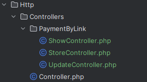

# Single Actions Resource Controllers for Laravel Dingo API
This package extends Dingo API with new feature - Route::resource combined with "Single Action Controllers".


## How does it work?
It's really simple, 
 - Just add new route like this `$api->singleActionResource('payments-by-link', ['uses' => 'PaymentByLink']);`
 - Create new single action (invokable) controllers for each action you need, like this. 
 - Each controller should have public function __invoke
## Installation
`composer require clean-bandits/single-action-resource-controllers-for-laravel-dingo-api`  
In DingoServiceProvider add this code
```php
 public function register(): void
    {
        $this->app->extend('api.router', function (\Dingo\Api\Routing\Router $router) {
            return new \CleanBandits\SingleActionResourceControllersForLaravelDingoApi\Router($router);
        });
        parent::register();
    }
```

